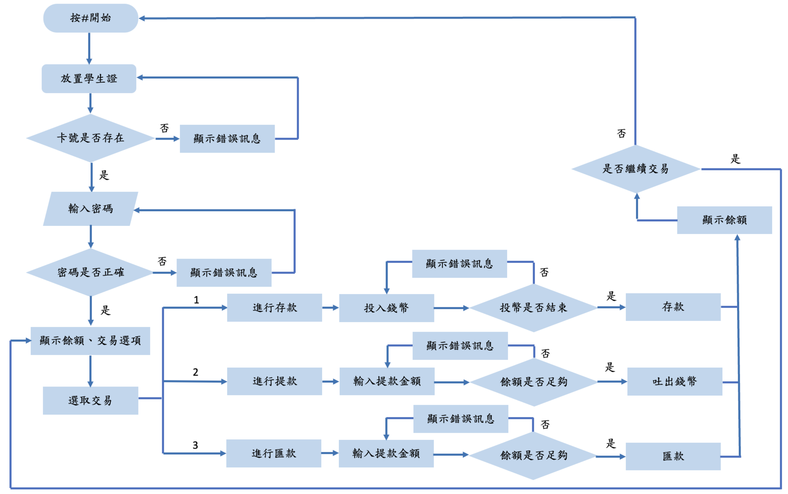
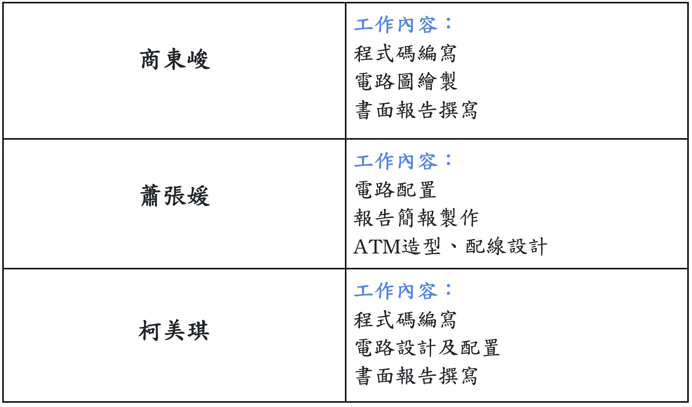

# 嵌入式系統 - 十元世界ATM
## 系統簡介
* 此系統使用Arduino以及ESP32所建置而成。
* 使用到的元件
    * 伺服馬達
    * 光遮斷器
    * 蜂鳴器
    * RC522
    * OLED
    * 數字鍵盤
* 本系統包含存款、提款以及轉帳三大功能，主要運作流程如下所示
  
* 詳細功能介紹可以前往[專題報告書](書面報告/書面報告.pdf)或是[專題簡報](書面報告/十元世界的ATM.pptx)閱覽，也可以直接觀看[專題Demo影片](https://www.youtube.com/watch?v=S1GzbQeTjJI)。

## 組員
* 1093332 商東峻 
* 1094842 蕭張媛 
* 1094908 柯美琪

## 工作分配

## Demo影片
* [專題Demo影片](https://www.youtube.com/watch?v=S1GzbQeTjJI)